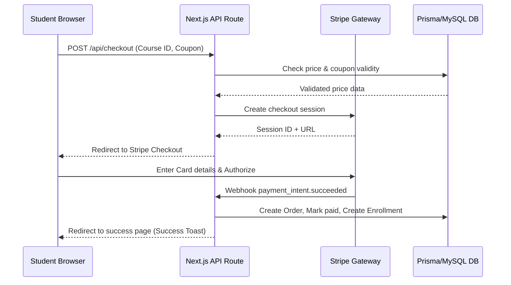
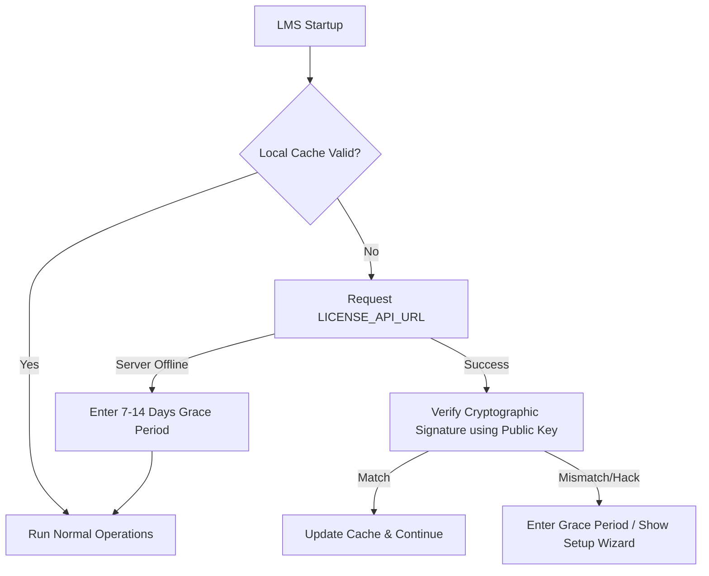

# System Architecture: Lernexa LMS

Lernexa LMS utilizes a modern, modular, feature-based architecture built on top of Next.js (App Router).

## 1. Directory Structure Blueprint

```text
src/
├── app/                        # Next.js App Router (Routing and Pages)
│   ├── (public)/               # Static/dynamic public pages (Marketplace, Landing)
│   ├── (auth)/                 # Authentication page routes
│   ├── install/                # Step-by-step setup installer wizard
│   ├── dashboard/              # Student dashboard
│   ├── instructor/             # Instructor workspace (Curriculum Builder)
│   ├── admin/                  # Central Admin portal (Licensing, Settings)
│   └── api/                    # Public and private REST endpoints
│
├── features/                   # Encapsulated feature domains
│   ├── auth/                   # Credentials, session middleware, RBAC checks
│   ├── licensing/              # License checks, local cache, crypto signatures
│   ├── courses/                # Video learning, course state machine
│   ├── commerce/               # Stripe checkout, shopping cart, discounts
│   └── mentorship/             # Meeting calendars, booking state machine
│
├── components/                 # Shared UI and layout systems
│   ├── ui/                     # shadcn/ui components (Buttons, Cards, Dialogs)
│   ├── layout/                 # Global headers, footers, and sidebar components
│   └── shared/                 # Generic reusable components
│
├── lib/                        # Singletons and SDK configurations
│   ├── db.ts                   # Prisma client instantiation
│   ├── stripe.ts               # Stripe payment client wrapper
│   └── crypto.ts               # Cryptographic utilities (public key signature verification)
```

---

## 2. Dynamic Data Flow

### 2.1 Course Purchase Flow


### 2.2 Client-Side License Verification


---

## 3. Technology Stack Decisions

- **Framework**: Next.js 15 (App Router, Server Actions for lightweight updates, Server Components for SEO and speed).
- **Styling**: Tailwind CSS (clean utility utility-first layout styling).
- **ORM**: Prisma ORM mapping directly to a MySQL instance.
- **State Management**: React Context / Zustand for lightweight client state (Cart, active filters).
