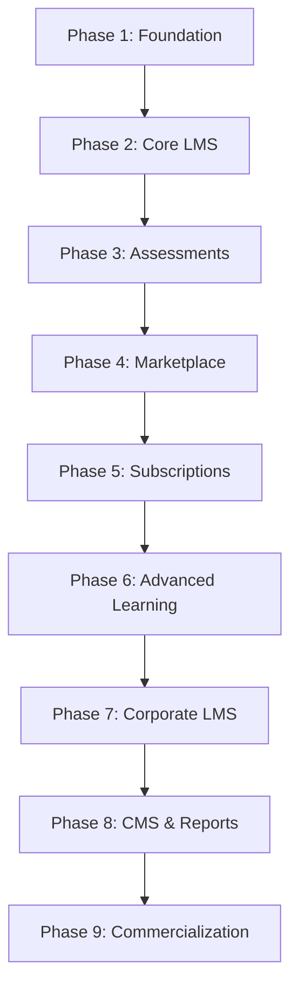

# Feature Roadmap: Lernexa LMS

Development is partitioned into logical phases to guarantee quality before advancing.

---

## 1. Feature Allocation by Phase

### Phase 1: Foundation (Current)
- Initialize project with Next.js 15, TypeScript, Tailwind, and Prisma/MySQL.
- Setup authentication database schemas and RBAC permissions matrices.
- Verification of dev build, lints, and initial prisma migrations.

### Phase 2: Core LMS & Curriculum Builder
- Drag-and-drop Curriculum Builder.
- Lesson types: Video (support Cloudflare R2 / S3), Audio, PDF, Text.
- Progress tracking (lesson completed / video percentage watch).

### Phase 3: Assessment & Certificates
- Quiz and Exam system (questions bank, timers, scoring).
- PDF certificate generator with QR verification routing `/verify/[id]`.

### Phase 4: Course Marketplace
- Search and multi-criteria filters.
- Shopping cart, checkout page, orders, coupons.
- Stripe payment integration.

### Phase 5: Monetization & Commissions
- Subscription plans and membership access controls.
- Course bundles.
- Instructor revenue splitting rules and payout pipelines.

### Phase 6: Mentorship & Live Classes
- Mentor profiles, schedules, timezone calendar booking.
- Live class scheduling (Jitsi / Zoom / Google Meet integrations).

### Phase 7: Corporate LMS
- Organization accounts with manager portals.
- Departments, teams, and course assignments.
- Progress tracking across teams.

### Phase 8: CMS & Platform Analytics
- Blog management, dynamic homepage editor, customizable FAQs.
- Event-based tracking (clicks, plays, completions) and interactive Admin dashboards.

### Phase 9: Commercialization
- 10-step installation wizard (db check, license validation, admin setup).
- Cryptographic licensing client check.
- Seeding script (`prisma/seed.ts`) and Docker configurations.
